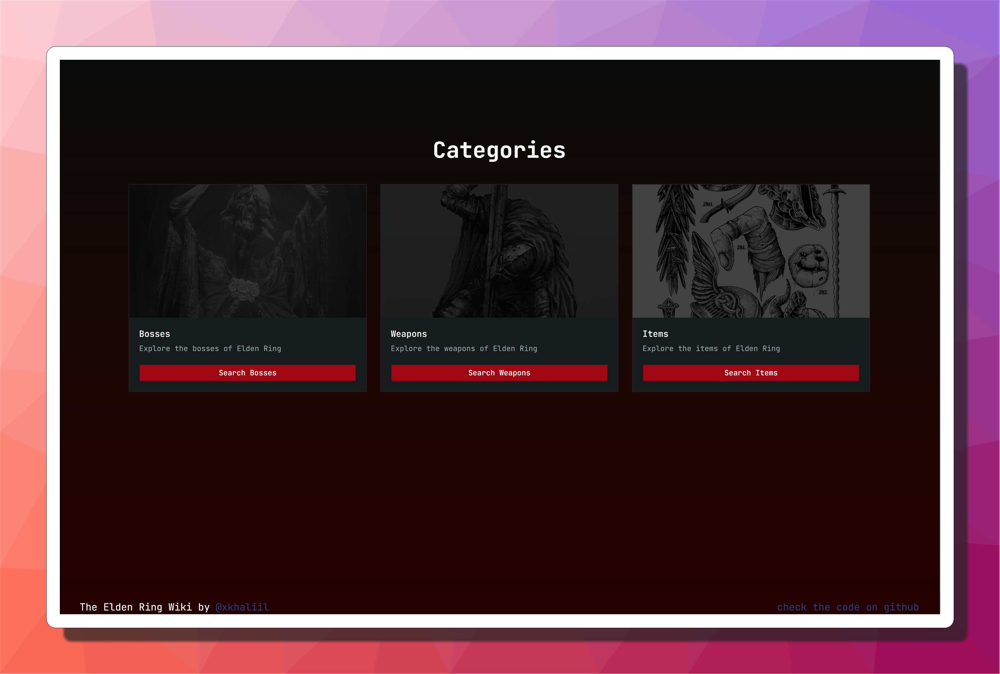
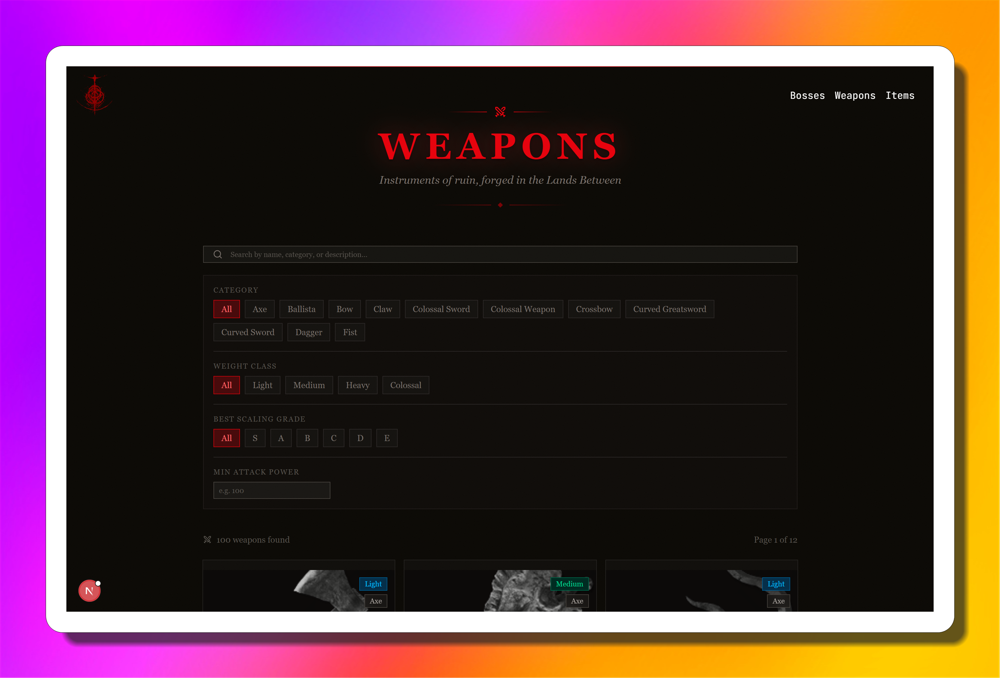

# Elden Ring Vue Explorer

Welcome to the **Elden Ring Vue Explorer**! This is a comprehensive, interactive web application built with **Vue 3**, **Vite**, and **Tailwind CSS** that lets you explore the vast world of Elden Ring. Discover details about terrifying bosses, powerful weapons, and essential items from the Lands Between.

## 🚀 Deployed Site

[**Check out the live project here!**](https://elden-ring-vue-js.vercel.app/)

---

## 📸 Screenshots

Here is a glimpse of what the project looks like:

### Home Page

The main landing page of the application featuring an immersive design to welcome tarnished explorers.


### Categories

Navigate through the vast lore by selecting your desired category: Bosses, Weapons, or Items.



### Bosses List

A comprehensive list of all the terrifying bosses you can encounter in the Lands Between.


### Boss Detail View

In-depth lore, stats, and details about a specific boss.


### Weapons List

Browse through the massive arsenal of weapons available in the game.



### Weapon Detail View

Detailed statistics, scaling, and requirements for a specific weapon.


### Items List

Explore the various consumables, key items, and materials scattered across the world.


### Item Detail View

Learn about the effects and lore of a specific item.


---

## 🛠️ Technology Stack

- **Framework:** [Vue 3](https://vuejs.org/) (Composition API)
- **Build Tool:** [Vite](https://vitejs.dev/)
- **Styling:** [Tailwind CSS](https://tailwindcss.com/) & [shadcn-vue](https://shadcn-vue.com/)
- **Routing:** [Vue Router](https://router.vuejs.org/)
- **Testing:** [Vitest](https://vitest.dev/)
- **Component Explorer:** [Storybook](https://storybook.js.org/)
- **3D Rendering:** [Three.js](https://threejs.org/) (Used for immersive background effects)

---

## 💻 Available Scripts

In the project directory, you can run the following commands via `npm`:

### Development & Build

- **`npm run dev`**
  Starts the Vite development server with Hot Module Replacement (HMR).
- **`npm run build`**
  Runs type-checking and bundles the app for production.
- **`npm run preview`**
  Boots up a local web server to preview your production build (`dist` folder).
- **`npm run build-only`**
  Builds the application for production without running type-checking.
- **`npm run type-check`**
  Runs the TypeScript compiler (`vue-tsc`) to check for type errors.
- **`npm run analyze`**
  Builds the project and automatically opens a bundle analyzer to inspect your chunk sizes.

### Testing & UI

- **`npm run test`**
  Runs the unit test suite using Vitest.
- **`npm run storybook`**
  Starts the Storybook development environment on `localhost:6006` to browse and develop your UI components in isolation.
- **`npm run build-storybook`**
  Builds your Storybook into a static web app for deployment.

### Code Quality (Linting & Formatting)

- **`npm run lint`**
  Runs both ESLint and Oxlint to catch and fix code quality issues.
- **`npm run lint:eslint`**
  Runs ESLint specifically with auto-fix enabled.
- **`npm run lint:oxlint`**
  Runs the lightning-fast Oxlint tool for immediate issue detection.
- **`npm run format`**
  Formats all your source files using Prettier.
- **`npm run format:check`**
  Checks if your files are properly formatted without making changes.
- **`npm run prepare`**
  Installs Husky for managing Git hooks (e.g., pre-commit linting).

---

## ⚙️ Getting Started

1. Clone the repository.
2. Install dependencies:
   ```bash
   npm install
   ```
3. Start the development server:
   ```bash
   npm run dev
   ```
4. Open [http://localhost:5173](http://localhost:5173) to view it in your browser.
